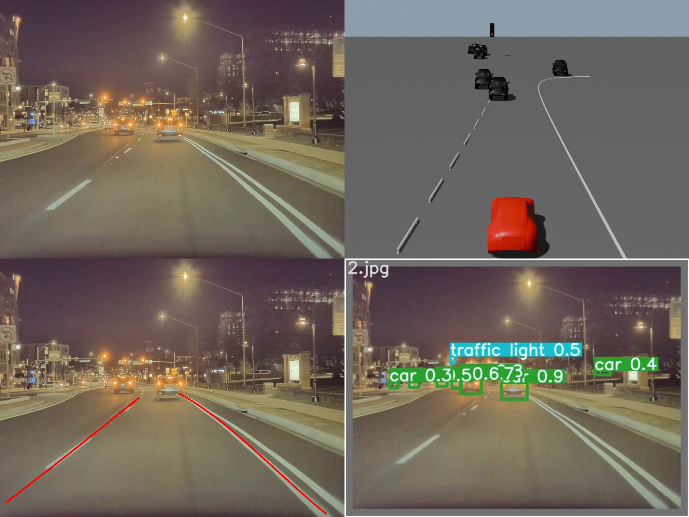
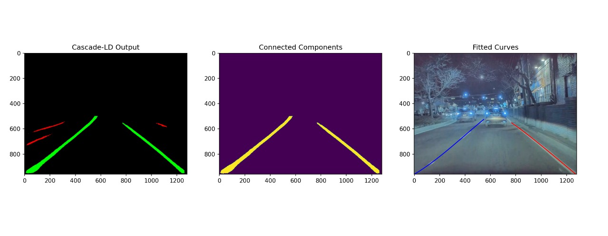
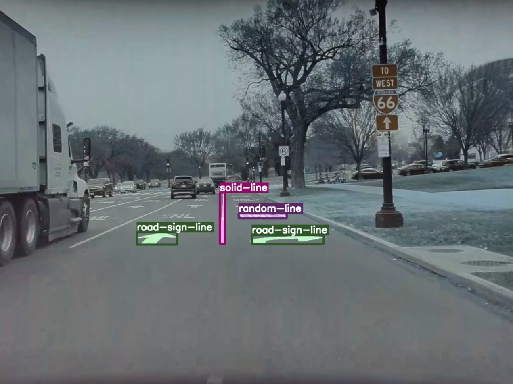

# EinsteinVision

## Ground Truth, Render Image, Lane Detection and Object Detection.
|  |
|:--:|:---:|

<!--  | -->

### Analysis 
 
 ## Lane type Detection Processing 
 

 ## Lane arrow Detection 
 

 ## Object Detection Processing
 

## Here's how to run the models
For Detic,
1) cd Detic
2) python demo.py --config-file configs/Detic_LCOCOI21k_CLIP_SwinB_896b32_4x_ft4x_max-size.yaml --input desk.jpg --output out.jpg --vocabulary lvis --opts MODEL.WEIGHTS models/Detic_LCOCOI21k_CLIP_SwinB_896b32_4x_ft4x_max-size.pth

Here, --input can also be whole folder path and correspondingly --output be output folder path

For Lane Detection using Masked RCNN,
1) cd Lane_Detection_using_Mask_RCNN_An_Instance_Segmentation_Approach
2) At line 54 and 78, output folder path and input folder path has to be specified respectively.
2) python inference_image.py --weights outputs/training/road_line/model_15.pth --threshold 0.8 --show

For OSX (Human Pose Detection),
1) cd OSX/demo
2) python my.py --gpu 0 --img_path IMG_PATH --output_folder OUTPUT_FOLDER

YOLO3D, Car Classification, Traffic Light Color Detection and Optical Flow all are integrated with Detic main code to give final output.
